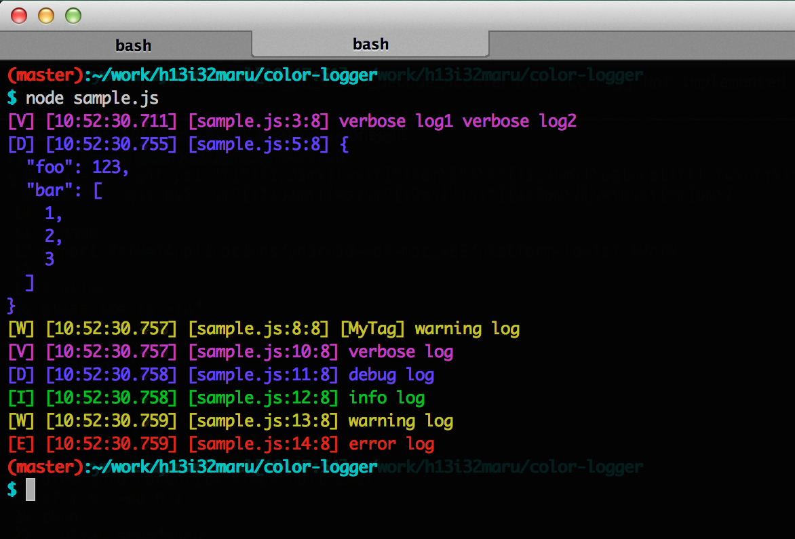

Used with updated [EnterTheNameHere/esdoc-monorepo](https://github.com/EnterTheNameHere/esdoc-monorepo).
Original color-logger is [here](https://github.com/h13i32maru/color-logger).

# Color Logger
colorful logger for node.

```
npm install @enterthenamehere/color-logger
```

## Example

```js
import Logger from '@enterthenamehere/color-logger';

// simple usage
Logger.v('verbose log1', 'verbose log2');

// use object
Logger.d({foo: 123, bar: [1, 2, 3]});

// all log level and colors
Logger.v('verbose log');
Logger.d('debug log');
Logger.i('info log');
Logger.w('warning log');
Logger.e('error log');
```



## API Reference
[https://h13i32maru.github.io/color-logger/](https://h13i32maru.github.io/color-logger/)

## License
MIT
