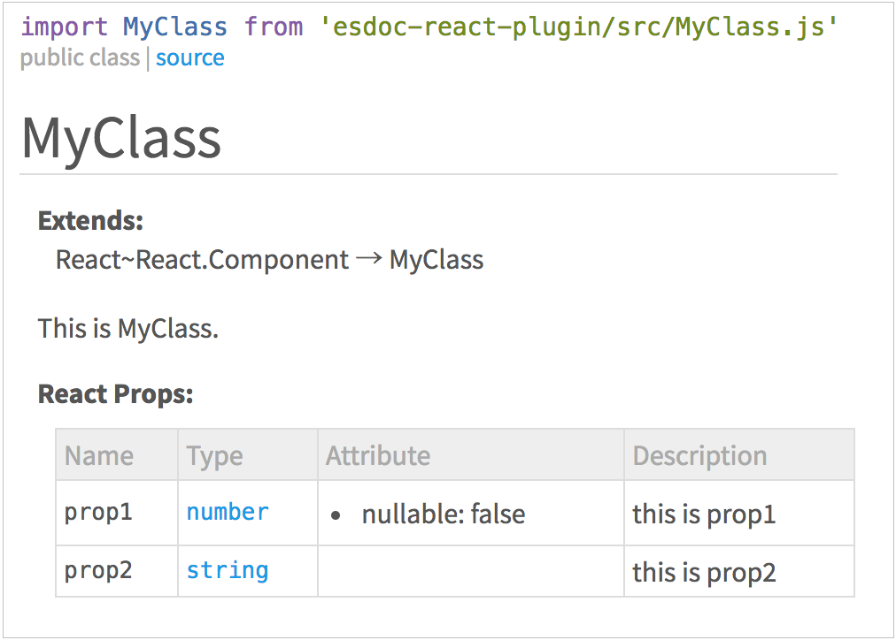

# ESDoc React Plugin (PoC)

Use with updated [EnterTheNameHere/esdoc-monorepo](https://github.com/EnterTheNameHere/esdoc-monorepo).  
Original esdoc is [here](https://github.com/esdoc/esdoc).

**This plugin is proof of concept.**
**So, the plugin has only minimum features.**
**We are waiting for your pull request!**

## Example
```js
/**
 * This is MyClass.
 * @reactProps {!number} prop1 - this is prop1
 * @reactProps {string} prop2 - this is prop2
 */
export default class MyClass extends React.Component {
}
```



## Install
```bash
npm install @enterthenamehere/esdoc-react-plugin
```

## Config
```json
{
  "source": "./src",
  "destination": "./doc",
  "plugins": [
    {"name": "@enterthenamehere/esdoc-standard-plugin"},
    {"name": "@enterthenamehere/esdoc-react-plugin"}
  ]
}
```

## Dependency
- esdoc-standard-plugin

## LICENSE
MIT

## Author
[Ryo Maruyama@h13i32maru](https://github.com/h13i32maru)
